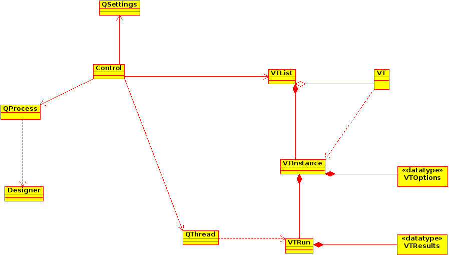

% Xmas Controller Design
% Guus Bonnema
% December 2014

# Controller

# Controller motivation

Why do we need a controller? 

* Manage and create the user interface.
* Manage and create the verification tools (VT).
* Manage and create the processes to execute VT instances
* Coordinate communication between user interface and VT instances.

# Controller design

A picture of the controller design in UML.

# Controller function

The controller contains the following functions:

* Manage and create the user interface.
  - Start up xmas designer
  - Build xmas model from file
* Manage and create the verification tools (VT).
  - initialize VT options per instance
  - select VT instances
* Manage and create the processes to execute VT instances
  - Create a VT instance with VT options
  - Start up VT instances
* Coordinate communication between user interface and VT instances.
  - Channel output from VT instance 
  - Channel input to VT instance
  - Guard progress of VT instance

# Controller dynamics

## Designer dynamics

* Creating a new process using QProcess for the designer
* Using QSettings for the applications options
* Starting the designer with the appropriate options

## VT dynamics

* Creating a new VTList using the setting through QSettings
* Selecting the initial VTs through the settings
* Starting VT instances using QThread
* Creating a window of error and warning messages if on gui, or redirecting to standard
  output or standard error if on commandline.

# Controller structure

The controller is an object that controls the xmas designer and the xmas
VT instances.

